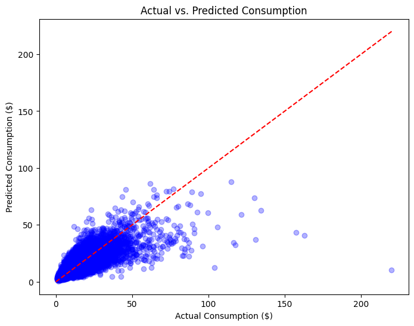
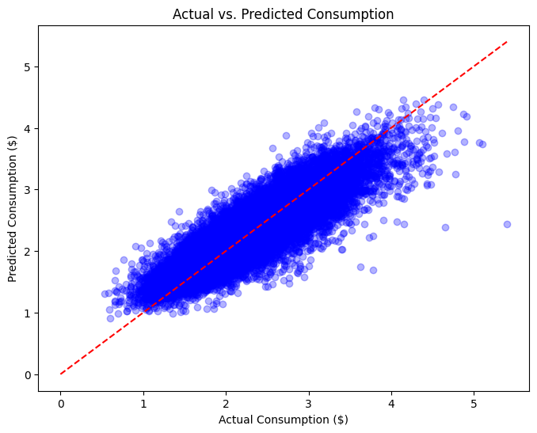

# World Bank Poverty Prediction Challenge 🌍

Ranked #339 out of 1,322 Global Competitors (Top 25%)

## Description
This repo hosts the solution for the Data Driven and World Bank organised competition. The challenge was to train a model capable of predicting with accuracy and precision, the household-level consumption and calculate the poverty rate strictly below given thresholds.

It includes:
- Code for data preprocessing, some feature engineering, and model fitting.
- Poverty prediction model 
- Data imputer and encoding pipelines. 

## My approch: 

Development Environment: 
- Google colab

Data engineering: 
- Merged feature dataset and ground truths dataset on target features for unified pipline model training. 

Data preprocessing: 
- Handle missing data using imputation. Median strategy for numerical and most frequent strategy for categorical data using.
- Encoded categorical data using ordinal encoding for 80+ features. This was chosen over One-Hot Encoding to handle high cardinality and avoid the Curse of Dimensionality.

Model selection: 
- Chose XGBoost because of its optimisation for tabular data. 

Feature engineering: 
- Handled a skewed data distribution (figure1) by implementing a logarthimic transformation to normalise target variabes (figure2). This resulted in improving the MAE (Mean Absolute Error). from 3.27 to 3.12

## Figure 1: Target Distribution

## Figure 2: Target Distribution
